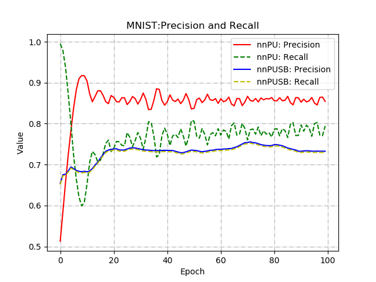

# nnPUSB
Learning from positive and unlabeled data with a selection bias(nnPUSB) reproductive code on MNIST

Some code comes from [kiryor's](https://github.com/kiryor/nnPUlearning). 

## Details

## Requirements
* Python 3
* Pytorch >= 1.0
* Scikit-learn >= 0.2
* Numpy >=1.1

## Quick start

You can set your GPU on the global variable *device* in  `args.py`

You can run an example code of MNIST for comparing the performance of nnPU learning and nnPUSB learning.

```python
python3 train.py
```

You can see additional information by adding ```--help```.

## Example result
* nnPU / nnPUSB Precision Recall in `result/precision_recall.png`



## Reference

[1] Masahiro Kato and Takeshi Teshima and Junya Honda. "Learning from Positive and Unlabeled Data with a Selection Bias." International Conference on Learning Representations. 2019.

[2] Ryuichi Kiryo, Gang Niu, Marthinus Christoffel du Plessis, and Masashi Sugiyama. 
"Positive-Unlabeled Learning with Non-Negative Risk Estimator." Advances in neural information processing systems. 2017.

[3] LeCun, Yann. "The MNIST database of handwritten digits." http://yann.lecun.com/exdb/mnist/ (1998).
